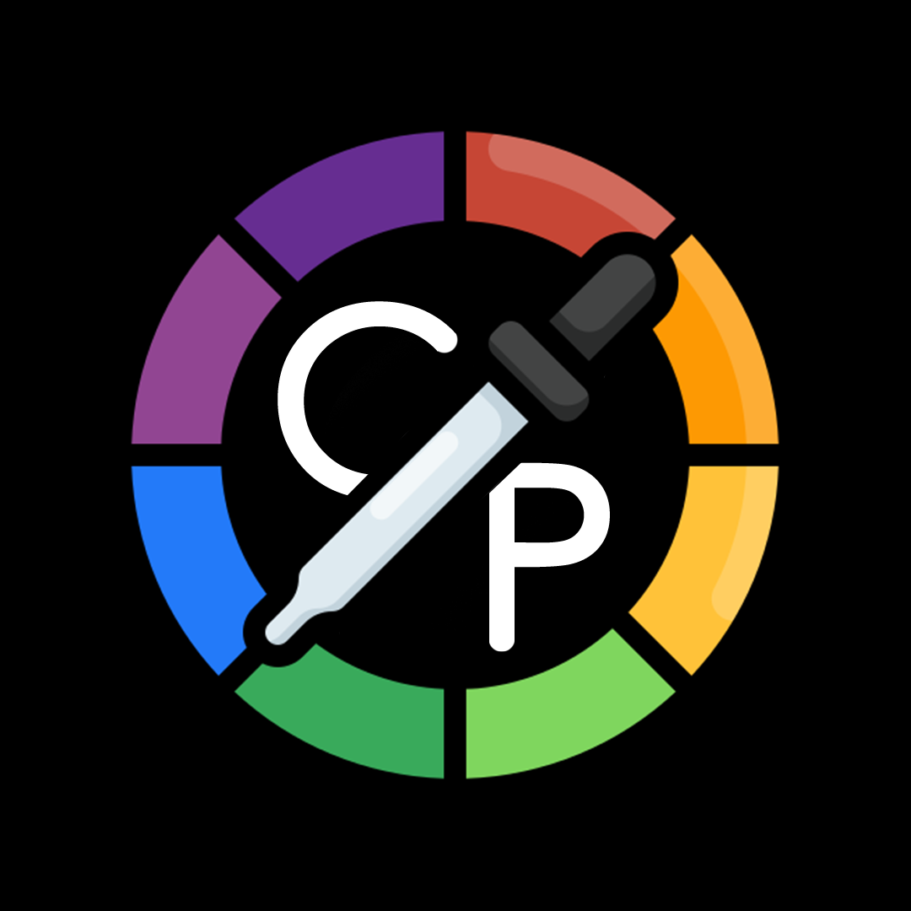
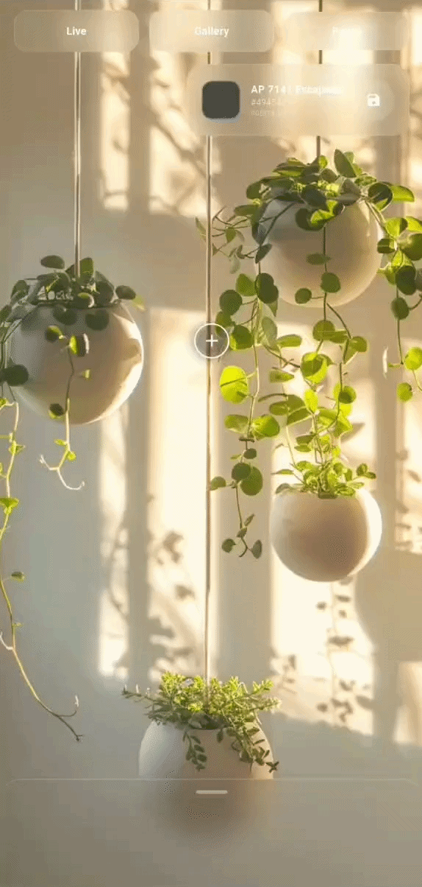

<p align="center">
  
  <h1 align="center" style="font-weight: 800; letter-spacing: -1px;">ChromaPick</h1>
  <p align="center" style="font-size: 1.2rem; color: #6a737d;">Advanced Camera Color Picker & Asian Paints Matcher</p>
</p>

<p align="center">
  <a href="https://flutter.dev/">
    
  </a>
  <a href="https://dart.dev/">
    
  </a>
  <a href="https://github.com/Dhvani30/color_picker/blob/main/LICENSE">
    
  </a>
  <a href="https://github.com/Dhvani30/color_picker/stargazers">
    
  </a>
</p>

<p align="center">
  
</p>

<p align="center">
  
  <br>
  <sub><i> Drag, match, and save colors in real-time</i></sub>
</p>

> A beautiful, glassmorphic Flutter application that lets you capture real-world colors using your live camera or photo gallery, instantly matching them to a comprehensive **Asian Paints** database.

---

## ✨ Key Features

-  **Live Camera Picking**: Drag a precision crosshair over the live camera feed to sample colors in real-time.
-  **Gallery Support**: Import images from your device to extract colors from existing photos.
-  **Asian Paints Database**: Instantly matches sampled RGB values to the closest official Asian Paints color name (Melange, Brights, and Whites).
-  **Glassmorphism UI**: Modern, frosted-glass interface with smooth animations and transparent overlays.
-  **Rich Haptic Feedback**: Tactile vibrations on every interaction (button taps, crosshair dragging, saving, and deleting).
-  **Persistent History**: Automatically saves your captured colors, HEX, RGB, and timestamps locally.
-  **Freeze Frame**: Pause the live camera feed to accurately pick colors from a still frame.

---

## 🛠️ Tech Stack

<p align="center">
  
  
  
  
  
  
</p>

---

## 🚀 Getting Started

Follow these simple steps to run the project locally:

### 1. Prerequisites
- Install [Flutter SDK](https://docs.flutter.dev/get-started/install)
- Install [Git](https://git-scm.com/)

### 2. Clone the Repository
```bash
git clone https://github.com/Dhvani30/color_picker.git
cd color_picker
```

### 3. Install Dependencies
```bash
flutter pub get
```

### 4. Run the App
```bash
flutter run
```
*(Optional) To regenerate the app icons after adding your own `assets/logo.png`:*
```bash
dart run flutter_launcher_icons
```

---

## 📖 How to Use

1. **Grant Permissions**: Allow camera access when prompted on first launch.
2. **Pick a Color**: Drag the `+` crosshair over any object in the live camera view or imported gallery image.
3. **View Details**: The top-right glass panel will instantly display the closest **Asian Paints** color name, HEX code, and RGB values.
4. **Save**: Tap the `Save` icon to store the color in your persistent history sheet (complete with date and time).
5. **Manage History**: Tap any saved color in the bottom sheet to reload it, or **long-press** to delete it.

---

## 🤝 Contributing

Contributions, issues, and feature requests are highly welcome! 
1. Fork the Project
2. Create your Feature Branch (`git checkout -b feature/AmazingFeature`)
3. Commit your Changes (`git commit -m 'Add some AmazingFeature'`)
4. Push to the Branch (`git push origin feature/AmazingFeature`)
5. Open a Pull Request

---

## 📄 License

This project is licensed under the MIT License - see the [LICENSE](LICENSE) file for details.

---

<p align="center">
  <b>🌟 Show Your Support</b><br>
  If you found this project helpful or interesting, please consider giving it a <b>Star</b> on GitHub!<br>
  It helps the project grow, improves its search visibility, and motivates further development.
</p>

<p align="center">
  <a href="https://github.com/Dhvani30/color_picker/stargazers">
    
  </a>
</p>

---
<p align="center">
  <sub>Built with ❤️ by <a href="https://github.com/Dhvani30">Dhvani</a></sub>
</p>
